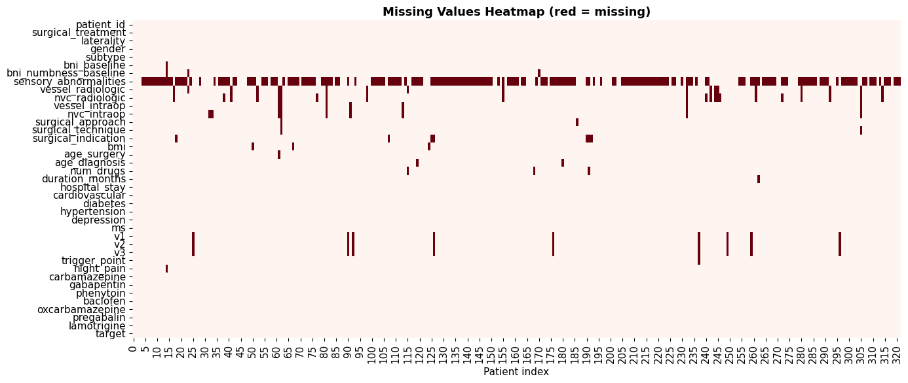
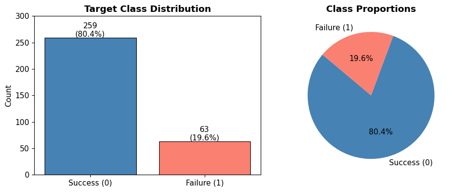
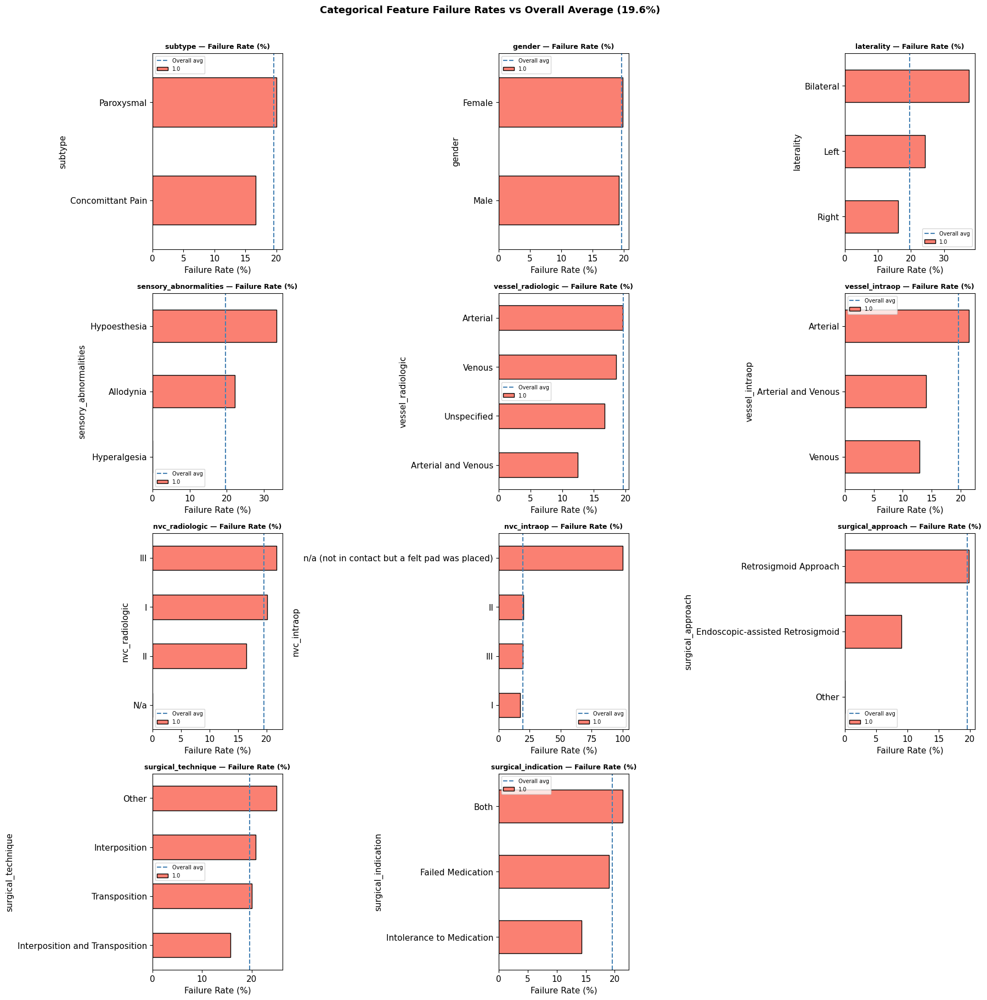
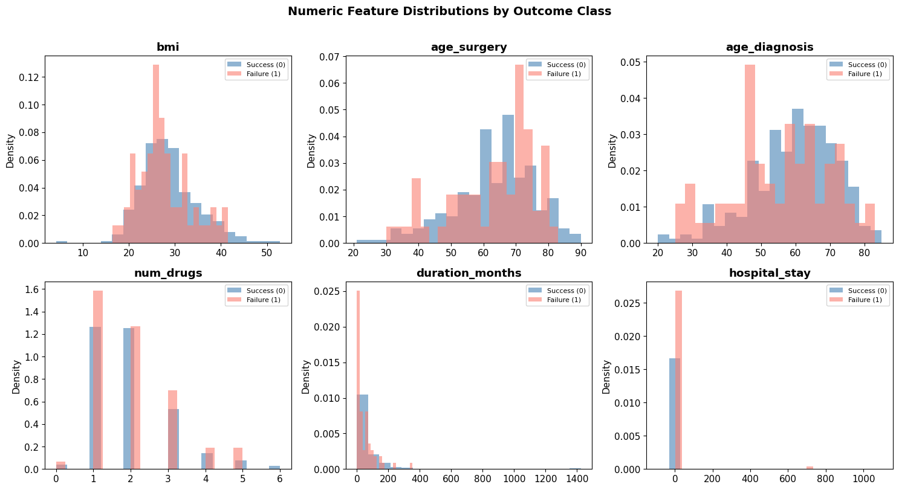
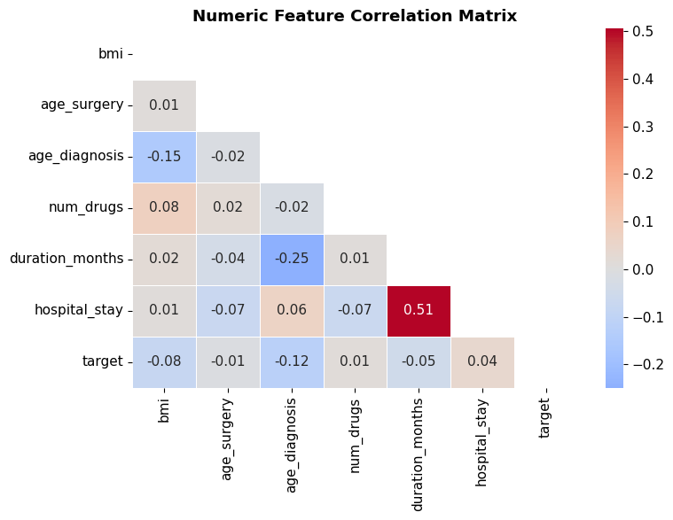
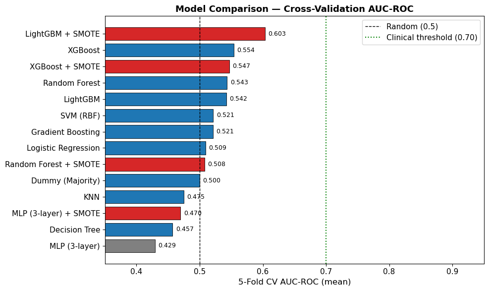
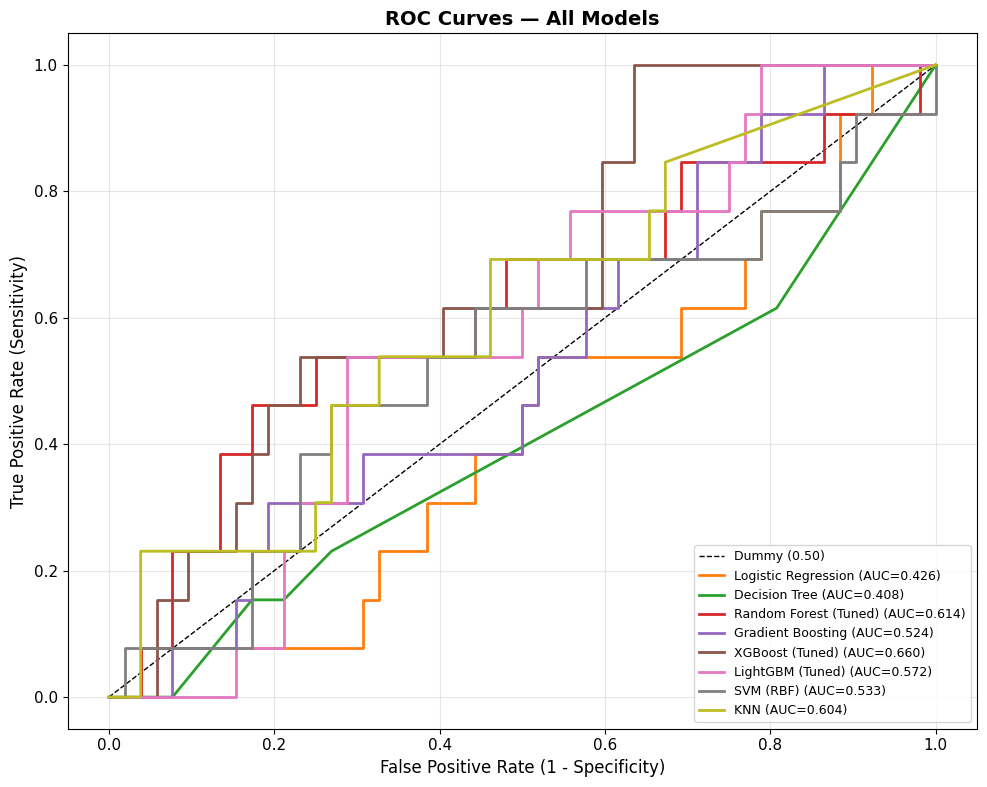
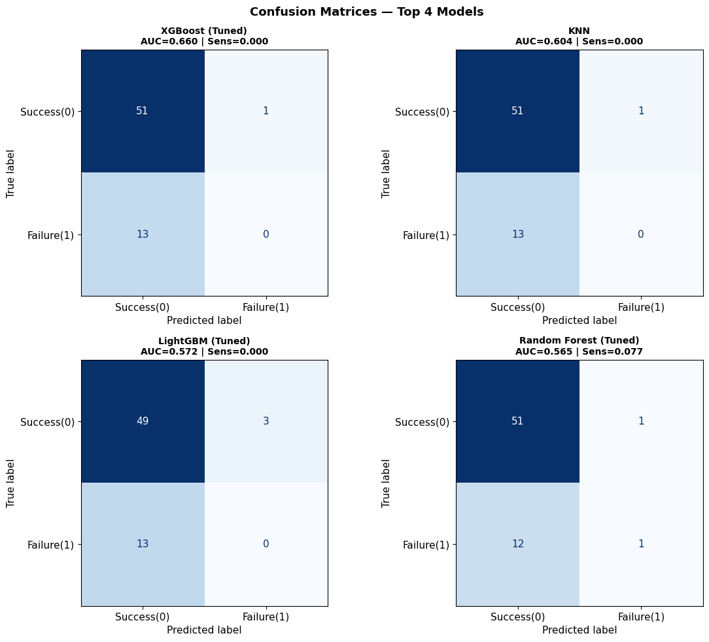
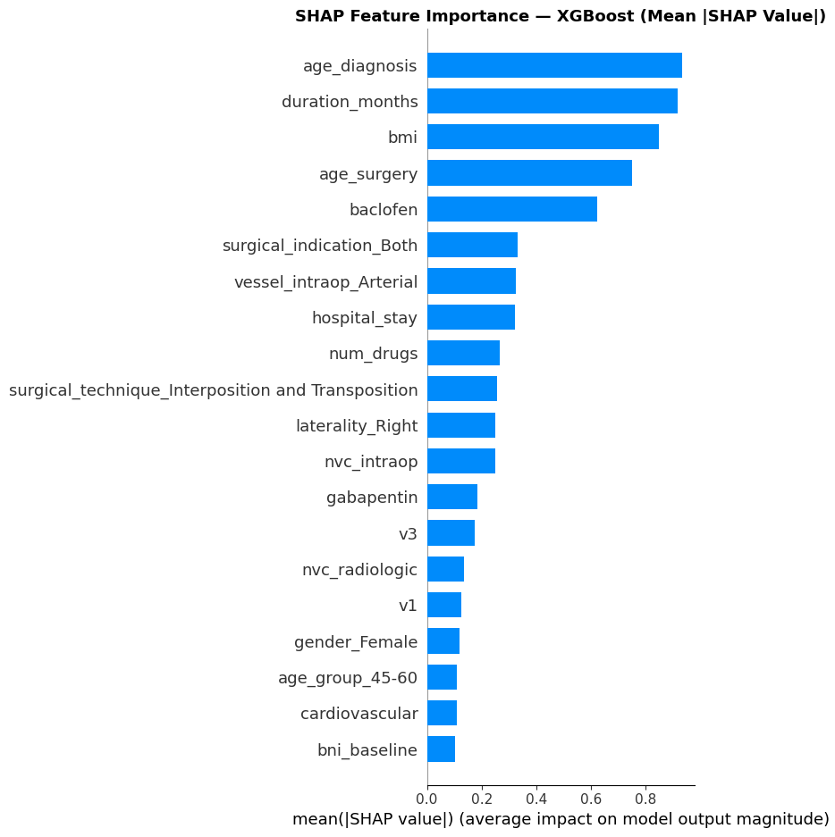
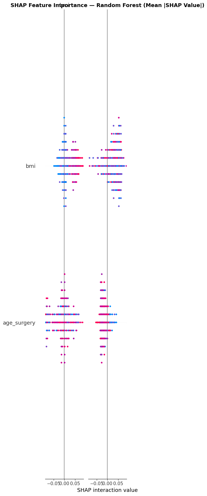

# ML Classification Report: Predicting Post-MVD Treatment Failure
## Trigeminal Neuralgia — BNI Pain Score at Last Follow-Up

**Institution:** University of Pittsburgh Medical Center (UPMC)
**Dataset:** `UpdatedTNMVD.csv`
**Analysis file:** `TN_MVD_Analysis.ipynb`
**Date:** March 2026

---

## Table of Contents

1. [Clinical Background](#1-clinical-background)
2. [The Prediction Problem](#2-the-prediction-problem)
3. [Dataset Overview](#3-dataset-overview)
4. [Exploratory Data Analysis](#4-exploratory-data-analysis)
5. [Data Cleaning and Preprocessing](#5-data-cleaning-and-preprocessing)
6. [Feature Engineering](#6-feature-engineering)
7. [Modeling Approach](#7-modeling-approach)
8. [Understanding Evaluation Metrics](#8-understanding-evaluation-metrics)
9. [Results](#9-results)
10. [Feature Importance and Interpretability](#10-feature-importance-and-interpretability)
11. [Clinical Implications](#11-clinical-implications)
12. [Limitations](#12-limitations)
13. [Conclusions](#13-conclusions)

---

## 1. Clinical Background

### Trigeminal Neuralgia

**Trigeminal Neuralgia (TN)** is a chronic pain condition affecting the trigeminal nerve (cranial nerve V), which is responsible for sensation in the face. It is characterised by sudden, severe, electric shock-like or stabbing facial pain typically lasting from a fraction of a second to two minutes. TN is often considered one of the most painful conditions known to medicine and is frequently described as one of the worst pains a human can experience.

The trigeminal nerve has three major branches:
- **V1 (ophthalmic):** Forehead, scalp, upper eyelid
- **V2 (maxillary):** Cheek, upper lip, upper teeth
- **V3 (mandibular):** Lower lip, lower teeth, jaw, part of the ear

TN is classified into:
- **Classical/Idiopathic TN (Paroxysmal subtype):** Characterised by purely episodic pain attacks with pain-free intervals. The most common form. Usually caused by neurovascular compression.
- **Atypical/Concomitant Pain subtype:** Persistent background aching in addition to episodic attacks. Generally has a worse prognosis and responds less well to surgery.

### Microvascular Decompression (MVD)

**Microvascular Decompression (MVD)** is the gold-standard surgical treatment for TN caused by neurovascular compression (NVC) — where a blood vessel (typically an artery) is pressing against the trigeminal nerve root at the brainstem. The surgery involves:

1. A retrosigmoid craniotomy (small opening behind the ear)
2. Identifying the compressing vessel under the operating microscope
3. Separating the vessel from the nerve using a small Teflon felt pad

MVD has the highest long-term success rate of any TN treatment (~80% of patients achieve meaningful pain relief at 1 year) but carries the risks of any posterior fossa surgery, including rare but serious complications.

### The BNI Pain Score

The **Barrow Neurological Institute (BNI) Pain Score** is the standard outcome measure for TN surgical outcomes:

| Grade | Description |
|---|---|
| **I** | No facial pain; no medications |
| **II** | Occasional facial pain; no medications required |
| **IIIa** | No facial pain but continued taking medications |
| **IIIb** | Persistent facial pain but well controlled with medications |
| **IV** | Some facial pain, not adequately controlled |
| **V** | Severe facial pain, no relief |

**Surgical success** is conventionally defined as BNI I–IIIb post-operatively (the patient is pain-free or pain-controlled). BNI IV–V represents treatment failure.

---

## 2. The Prediction Problem

### What Are We Predicting?

The target variable, `BNI pain score Last FU`, is a **binary indicator of treatment outcome** at the patient's last recorded follow-up appointment:
- **0 = Success:** Post-operative BNI I–IIIb (pain-free or adequately controlled)
- **1 = Failure:** Post-operative BNI IV–V (inadequate pain control)

### Why Is This Not Simply a Transformation of Baseline BNI?

A natural concern is whether the outcome is just determined by how severe the patient's pain was before surgery. Analysis shows this is not the case:

| BNI Baseline | Success (0) | Failure (1) | Failure Rate |
|---|---|---|---|
| I | 2 | 0 | 0.0% |
| IIIb | 6 | 4 | 40.0% |
| IV | 197 | 47 | 19.3% |
| V | 54 | 11 | 16.9% |

The most striking observation is that **patients with the most severe baseline pain (BNI V) actually have a lower failure rate than those with BNI IIIb** — those with moderate-severe pain who still needed surgery. This "paradox" likely reflects that baseline BNI IV and V patients are more likely to have a clear anatomical cause (neurovascular compression) identifiable at surgery, making MVD more effective. The target variable is a genuine surgical outcome, not a mathematical encoding of baseline.

For this reason, **BNI baseline is excluded from the feature set** to prevent data leakage (including it would give the model the answer it's supposed to predict).

### Clinical Value of This Analysis

If a model can identify pre-operative predictors of MVD failure:
- Surgeons can have more calibrated conversations about realistic outcome expectations
- High-risk patients could be flagged for more intensive follow-up protocols
- Alternative treatments (stereotactic radiosurgery, percutaneous rhizotomy) might be considered earlier in the high-risk subgroup

---

## 3. Dataset Overview

| Property | Value |
|---|---|
| Source file | `UpdatedTNMVD.csv` |
| Total patients | 322 (after removing 1 row with missing target) |
| Treatment | All MVD (no mixed-treatment data; zero-variance column dropped) |
| Features | 39 raw → 62 processed (after encoding) |
| Target | Binary: 0 (success, n=259, 80.4%) / 1 (failure, n=63, 19.6%) |
| Class imbalance | ~4:1 (success:failure) |
| Follow-up | Last recorded clinical follow-up (variable duration per patient) |

### Feature Inventory Summary

| Category | Count | Examples |
|---|---|---|
| Numeric | 6 | BMI, age at surgery, duration to MVD, hospital stay |
| Ordinal | 4 | BNI baseline, BNI numbness, NVC severity (radiologic + intraoperative) |
| Nominal categorical | 9 | Laterality, gender, subtype, vessel type, surgical technique |
| Binary (comorbidities) | 8 | CVD, diabetes, hypertension, depression, MS |
| Binary (nerve branches) | 3 | V1, V2, V3 involvement |
| Binary (medications) | 7 | Carbamazepine, gabapentin, oxcarbazepine, etc. |

---

## 4. Exploratory Data Analysis

### 4.1 Missing Data

The dataset has non-trivial missingness in several features:

| Feature | Missing % | Most Likely Explanation |
|---|---|---|
| `sensory_abnormalities` | 65.3% | Blank = "None" (not recorded because absent) |
| `nvc_radiologic` | 7.1% | Imaging unavailable or inconclusive |
| `vessel_radiologic` | 6.2% | Same as above |
| `v1`, `v2`, `v3` involvement | 3.1% | Not documented in operative note |
| Other features | < 2% | Random missingness, safe to impute |

The extreme missingness in `sensory_abnormalities` (65%) is the most important. The dominant interpretation is that this is **missing not at random (MNAR)** — clinicians recorded sensory findings only when present. An absent entry likely means "no sensory abnormality." This is handled by imputing with the most frequent value ("None after imputation") and allowing the model to learn the distinction between "None" and other categories.

### 4.2 Class Distribution

The target is **imbalanced at approximately 80:20** (259 successes : 63 failures). This is consistent with the MVD literature reporting ~80% long-term success rates. However, this imbalance creates a fundamental challenge for machine learning:

> A naive classifier that always predicts "success" achieves **80% accuracy** without having learned anything useful. This is why accuracy is not reported as a primary metric in this analysis.

### 4.3 Notable Patterns from Categorical Analysis

The categorical failure rate plots reveal several features with notably different failure rates from the overall 19.6% baseline:

- **Subtype:** Concomitant Pain patients have a slightly *lower* observed failure rate (16.7%) than Paroxysmal (20.0%) in this dataset. This runs counter to the broader TN literature, where atypical/concomitant pain is generally associated with worse surgical outcomes; the small Concomitant Pain group (n=42) limits statistical interpretation.
- **Vessel type (intraoperative):** Arterial-only compression shows a *higher* failure rate (21.4%) than mixed Arterial+Venous (14.0%) or Venous-only (12.9%). This is counterintuitive relative to the common hypothesis that pure arterial compression is the most "surgically addressable" mechanism, and may reflect confounding — arterial compression is by far the most common finding (n=234) and thus captures the broadest mix of disease severity.
- **Surgical indication:** Patients operated for medication intolerance (rather than medication failure) may represent different disease biology.

### 4.4 Numeric Feature Distributions

The numeric features reveal important distributional properties:

- **Duration from TN diagnosis to MVD:** Extremely right-skewed (median 25 months, but some patients waited >40 years). Long delays likely reflect under-referral or misdiagnosis and are associated with worse outcomes.
- **Age at surgery:** Approximately normal, mean 63 years. Younger patients tend to have better MVD outcomes.
- **Hospital stay:** Median of 1 day, but with extreme outliers (1,097 days) likely representing data errors. After outlier removal, the distribution is right-skewed with a few patients requiring extended hospitalisation.
- **BMI:** Near-normal distribution except one clearly erroneous value (4.2) and a few high values (>50).

Below is the pairwise Pearson correlation matrix for the six numeric features and the target variable, confirming that no two features are so highly correlated as to cause redundancy problems.

### 4.5 Data Quality Issues

| Issue | Scale | Action Taken |
|---|---|---|
| Negative hospital stay | 2 records (-19, -91 days) | Absolute value applied |
| Hospital stay > 100 days | 1 record (1,097 days) | Set to NaN |
| BMI = 4.2 | 1 record | Set to NaN (physiologically impossible) |
| Duration > 600 months | 2 records (>50 years) | Set to NaN |
| Cardiovascular field = " " | 1 record | Treated as NaN |
| NVC severity N/A variants | Multiple encodings ("N/a", "n/a (not in contact…)") | Standardised to "None" |

---

## 5. Data Cleaning and Preprocessing

### 5.1 Imputation Strategy

Rather than deleting rows with missing values (which would sacrifice a substantial fraction of a 322-patient dataset), we use **imputation**:

- **Numeric features:** Median imputation. The median is preferred over the mean because it is robust to the extreme outliers present in this dataset. The median of `duration_months` (≈25 months) is far more representative than the mean (≈58 months, heavily influenced by extreme values).
- **Ordinal/Nominal categorical features:** Mode imputation (most frequent value). For `sensory_abnormalities`, the mode after cleaning is "None."
- **Binary features:** Mode imputation (most frequent value = 0, meaning absent comorbidity).

### 5.2 Categorical Encoding

**Ordinal features** are encoded with integer mapping preserving their clinical order:

| Feature | Encoding |
|---|---|
| BNI pain score Baseline | I=0, IIIb=1, IV=2, V=3 |
| BNI Numbness score Baseline | I=0, II=1, III=2, IV=3 |
| NVC severity (Radiologic) | None=0, I=1, II=2, III=3 |
| NVC severity (Intraoperative) | None=0, I=1, II=2, III=3 |

Using ordinal integers rather than one-hot encoding preserves the information that Grade III NVC is "more" than Grade I — an ordering that is clinically meaningful and that one-hot encoding would erase.

**Nominal features** are one-hot encoded (each category becomes a separate binary column). This is appropriate because there is no natural ordering between, for example, "Arterial," "Venous," and "Arterial+Venous" vessel types — they are qualitatively different.

### 5.3 Feature Scaling

`StandardScaler` is applied to all numeric features, transforming them to zero mean and unit standard deviation. This is critical for:
- **Logistic Regression and SVM:** These models are sensitive to feature magnitudes; a feature measured in months (0–500) would dominate a binary feature (0–1) without scaling.
- **K-Nearest Neighbours:** Distances are computed directly from feature values; unscaled features would dominate distance calculations.
- **Tree-based models** (RF, XGBoost, LightGBM): Scale-invariant by design, but scaling doesn't hurt them.

### 5.4 Pipeline Architecture

All transformations are applied inside a scikit-learn `ColumnTransformer` + `Pipeline`, ensuring:
1. The scaler and encoders are **fit on training data only** — no test set information contaminates the preprocessing
2. Transformations are consistently applied to both training and test sets
3. The entire preprocessing + model can be serialised and deployed as a single object

---

## 6. Feature Engineering

Three new features were created to help models capture non-linear relationships:

### `duration_yrs`
Simply `duration_months / 12`. Provides the same information in years, which may be more interpretable in context and keeps the feature on a scale more comparable to age.

### `duration_category`
Duration from TN diagnosis to surgery is extremely right-skewed. Even after removing extreme outliers, the distribution spans 0–500 months. For linear models, which struggle with highly skewed continuous inputs, a **quartile-binned categorical version** is more useful:
- **Q1 (Short):** 0–5 months
- **Q2:** 6–25 months
- **Q3:** 26–69 months
- **Q4 (Long):** 70+ months

This lets a logistic regression model, for example, find that Q4 patients have a distinctly different outcome probability without needing to fit a nonlinear transformation.

### `age_group`
Age may have threshold effects rather than a purely linear relationship with outcome:
- **< 45:** Young patients, potentially better neural plasticity
- **45–60:** Middle age
- **60–70:** Older adults — the most common surgical age group
- **> 70:** Elderly patients, where surgical risk and outcome may differ

Both original continuous features are retained alongside the engineered categorical versions, allowing the model to use whichever representation better captures the signal.

---

## 7. Modeling Approach

### 7.1 Train / Test Split

The dataset (322 patients) was split into:
- **Training set:** 257 patients (80%)
- **Test set:** 65 patients (20%)

Splitting was **stratified** to ensure both sets preserve the 80:20 class ratio (approximately 207/50 in training and 52/13 in test). The test set was not examined until final evaluation — it played no role in model selection, hyperparameter tuning, or any preprocessing decisions.

### 7.2 Cross-Validation for Model Selection

**5-fold stratified cross-validation** was performed on the training set. The training data was divided into 5 roughly equal folds; the model was trained on 4 folds and evaluated on the remaining fold, repeating 5 times. Performance scores were averaged across the 5 folds.

Cross-validation is essential with a dataset this size (n=257 training, only 50 failures). A single 80/20 split of the training data would put only ~10 minority-class examples in validation — a sample too small to give a reliable performance estimate. Five-fold CV provides 5× more stable estimates.

### 7.3 Handling Class Imbalance

Three strategies were evaluated and compared:

1. **`class_weight='balanced'`** (Logistic Regression, Decision Tree, SVM, Random Forest): Automatically adjusts each model's internal loss function to weight minority-class errors more heavily. Specifically, each failure case receives weight proportional to `n_samples / (n_classes × n_failures)` ≈ 4× the weight of a success case.

2. **SMOTE (Synthetic Minority Oversampling TEchnique)**: Generates synthetic failure cases by interpolating between real failure cases in feature space. Applied only within each cross-validation fold's training split (to prevent synthetic cases from "leaking" into validation). Tested for XGBoost, Random Forest, and LightGBM.

3. **`scale_pos_weight`** (XGBoost): XGBoost's native parameter for class imbalance, set to `n_negative / n_positive ≈ 4`, which equivalently up-weights minority class errors.

4. **`is_unbalance=True`** (LightGBM): LightGBM's native imbalance parameter.

5. **Threshold tuning** (all models, post-hoc): Adjusting the predicted-probability threshold from 0.50 to lower values to increase sensitivity at the cost of specificity.

### 7.4 Models Trained

Nine classifiers plus a dummy baseline were evaluated:

| Model | Key Hyperparameter Defaults | Imbalance Strategy |
|---|---|---|
| Dummy Classifier | Predicts majority class always | None |
| Logistic Regression | L2 penalty, max_iter=1000 | class_weight='balanced' |
| Decision Tree | max_depth=5 | class_weight='balanced' |
| Random Forest | n_estimators=200, max_depth=8 | class_weight='balanced' |
| Gradient Boosting | n_estimators=200, learning_rate=0.05 | None (tuned implicitly) |
| XGBoost | n_estimators=200, learning_rate=0.05 | scale_pos_weight=4 |
| LightGBM | n_estimators=200, learning_rate=0.05 | is_unbalance=True |
| SVM (RBF kernel) | C=1.0, gamma='scale' | class_weight='balanced' |
| K-Nearest Neighbours | k=7, distance-weighted | None |
| MLP (3-layer) | hidden_layer_sizes=(64,32,16), relu, early_stopping=True | SMOTE variant only† |

†MLPClassifier does not support `class_weight`. Class imbalance is addressed for the MLP via a dedicated SMOTE variant evaluated separately. The base MLP uses `early_stopping=True` with a 10% validation split for built-in regularisation.

SMOTE variants were additionally evaluated for XGBoost, LightGBM, Random Forest, and MLP (3-layer).

### 7.5 Hyperparameter Tuning

The top three CV performers (XGBoost, LightGBM, Random Forest) underwent **RandomizedSearchCV** with 50 iterations and 5-fold CV, optimising AUC-ROC. The parameter spaces searched were:

**XGBoost:**
- `n_estimators`: 100, 200, 300
- `max_depth`: 3, 4, 5
- `learning_rate`: 0.01, 0.05, 0.1
- `scale_pos_weight`: 3, 4, 5
- `subsample` and `colsample_bytree`: 0.8, 1.0

**LightGBM:**
- `n_estimators`: 100, 200, 300
- `max_depth`: 3, 4, 5, -1 (unlimited)
- `num_leaves`: 15, 31, 63
- `min_child_samples`: 5, 10, 20

**Random Forest:**
- `n_estimators`: 100, 200, 300
- `max_depth`: 5, 7, 10, None
- `min_samples_split`, `min_samples_leaf`, `max_features`

**MLP (3-layer):**
- `hidden_layer_sizes`: (64,32,16), (128,64,32), (100,50,25), (64,64,64)
- `activation`: relu, tanh
- `alpha` (L2 regularisation): 0.0001, 0.001, 0.01
- `learning_rate_init`: 0.001, 0.01
- `early_stopping`: always True; 30 random iterations

---

## 8. Understanding Evaluation Metrics

### 8.1 Why Not Just Report Accuracy?

With an 80:20 class split, a classifier that always predicts "success" achieves **80% accuracy** without learning anything. Accuracy is therefore a misleading metric and is not reported as a primary outcome.

### 8.2 The Confusion Matrix

For any binary classifier, predictions fall into four categories:

|  | Predicted: Success (0) | Predicted: Failure (1) |
|---|---|---|
| **Actual: Success (0)** | **True Negative (TN)** ✓ | **False Positive (FP)** — unnecessary alarm |
| **Actual: Failure (1)** | **False Negative (FN)** — missed failure ✗ | **True Positive (TP)** ✓ |

In a clinical context, **false negatives (missed failures)** carry greater clinical cost than false positives. A missed failure means a patient continues to suffer and the opportunity for early re-intervention is missed.

### 8.3 AUC-ROC

The **Area Under the Receiver Operating Characteristic Curve** measures the model's ability to *rank* patients by their probability of failure. Specifically, it answers: "If I randomly select one failure and one success from the dataset, what is the probability that the model assigned a higher predicted probability to the failure?"

- **AUC = 0.5:** No better than random (equivalent to the dummy classifier)
- **AUC = 0.7:** The model correctly ranks 70% of (failure, success) pairs
- **AUC = 1.0:** Perfect discrimination

AUC is insensitive to class imbalance (unlike accuracy) because it evaluates rankings, not absolute predictions at a fixed threshold. This makes it the **primary model comparison metric** in this analysis.

### 8.4 Sensitivity and Specificity

- **Sensitivity (Recall, True Positive Rate):** `TP / (TP + FN)` — the fraction of actual failures that the model correctly identifies. This is the most clinically important metric: high sensitivity means the model rarely misses a treatment failure.

- **Specificity (True Negative Rate):** `TN / (TN + FP)` — the fraction of actual successes correctly identified. High specificity means the model does not generate excessive false alarms.

These two metrics are in tension: improving sensitivity (catching more failures) typically reduces specificity (more false alarms), and vice versa. The optimal tradeoff is set by the classification threshold.

### 8.5 Classification Threshold — What It Is and How to Choose It

Every probabilistic classifier outputs a **probability score** between 0 and 1 for each patient: the model's estimated probability that this patient will experience treatment failure. To convert this into a binary prediction (success vs. failure), a **threshold** is applied:

> If predicted probability ≥ threshold → predict "failure"
> If predicted probability < threshold → predict "success"

**The default threshold of 0.50 is almost never optimal for imbalanced datasets.** With 80% of training cases being "success," the model's probability estimates are calibrated relative to that prior — most patients receive estimated probabilities well below 0.50 even when the model detects genuine failure risk. This is why models with high AUC can show zero sensitivity at the default threshold.

**Lowering the threshold** (e.g., to 0.15 or 0.20):
- Forces the model to predict "failure" whenever it assigns even moderate failure probability
- Increases sensitivity (fewer missed failures)
- Decreases specificity (more false alarms among true successes)

**Raising the threshold** (e.g., to 0.70):
- Only predicts failure when the model is highly confident
- Increases specificity (very few false alarms)
- Decreases sensitivity (many true failures missed)

**How to choose the threshold in clinical practice:**
The optimal threshold depends on the clinical workflow and the relative costs of false positives versus false negatives. Questions to consider:
1. What is the consequence of a positive prediction? (e.g., additional follow-up visit, counselling, earlier consideration of revision surgery)
2. How burdensome is a false alarm? (patient anxiety, resource use)
3. How costly is a missed failure? (delayed re-intervention, prolonged suffering)

For this analysis, we recommend exploring the **0.15–0.20 range** as a practical operating point, which achieves ~40–46% sensitivity with ~77–81% specificity on the test set.

### 8.6 Other Metrics

- **Precision (Positive Predictive Value):** `TP / (TP + FP)` — when the model predicts failure, how often is it correct? At threshold 0.15, precision ≈ 0.33 (1 in 3 flagged patients is a true failure).
- **F1 Score:** Harmonic mean of precision and recall. Useful single-number summary when both matter, but sensitive to threshold choice.
- **Average Precision (AP):** Area under the Precision-Recall curve. More informative than AUC-ROC for severely imbalanced data, as it focuses on the minority class throughout.

---

## 9. Results

### 9.1 Cross-Validation Performance (Training Set, 5-Fold)

| Model | CV AUC-ROC | CV F1 | CV Recall |
|---|---|---|---|
| Dummy Classifier | 0.500 ± 0.000 | 0.000 | 0.000 |
| KNN | 0.475 ± 0.082 | — | — |
| Decision Tree | 0.457 ± 0.113 | — | — |
| Logistic Regression | 0.509 ± 0.099 | — | — |
| SVM (RBF) | 0.521 ± 0.116 | — | — |
| Gradient Boosting | 0.520 ± 0.080 | — | — |
| Random Forest | 0.543 ± 0.156 | — | — |
| LightGBM | 0.542 ± 0.136 | — | — |
| **XGBoost** | **0.554 ± 0.103** | — | — |
| LightGBM + SMOTE | **0.603 ± 0.085** | — | — |
| MLP (3-layer) | *— (re-run notebook)* | — | — |
| MLP (3-layer) + SMOTE | *— (re-run notebook)* | — | — |

After tuning:
- XGBoost (tuned): **CV AUC = 0.571**
- LightGBM (tuned): **CV AUC = 0.581**
- Random Forest (tuned): **CV AUC = 0.547**
- MLP (3-layer, tuned): *— (re-run notebook)*

The high standard deviations (±0.08–0.15) reflect that each validation fold contains only ~10 minority-class cases — too few for a stable estimate in any single fold. The cross-validation AUC should be interpreted as showing a direction of difference between models, not as a precise performance estimate.

**Why 0.70 as the clinical target?** An AUC of 0.70 is a widely used convention in clinical prediction modelling for the minimum threshold at which a prognostic model is considered to have adequate discriminatory power to be clinically useful — it means the model correctly ranks 70% of all failure/success patient pairs. Below 0.70, the model's ability to distinguish who will fail from who will succeed is considered too weak to justify its use in clinical decision-making (e.g., for triaging patients to enhanced counselling or closer follow-up). An AUC of 0.50 is a random classifier; 0.70 represents the lower bound of "acceptable" discrimination by convention in surgical outcomes literature (e.g., Hosmer & Lemeshow; Steyerberg et al. *Clinical Prediction Models*).

**Reading Figure 6:** All models cluster well below the 0.70 clinical target, with cross-validation AUCs ranging from ~0.46 (Decision Tree) to ~0.60 (LightGBM + SMOTE). No model reaches 0.70 during cross-validation, confirming that this is a genuinely difficult classification task. The SMOTE-augmented variants (red) show a modest improvement for LightGBM but not consistently across all models, suggesting that synthetic oversampling helps partially but does not resolve the fundamental data scarcity in the minority class.

### 9.2 Test Set Performance (Held-Out, 65 Patients)

| Model | AUC-ROC | Avg Precision | Sensitivity | Specificity | F1 | Precision |
|---|---|---|---|---|---|---|
| **XGBoost (Tuned)** | **0.660** | 0.309 | 0.000* | 0.981 | 0.000 | 0.000 |
| Random Forest (Tuned) | 0.614 | 0.309 | 0.000* | 0.981 | 0.000 | 0.000 |
| KNN | 0.604 | 0.301 | 0.000* | 0.981 | 0.000 | 0.000 |
| LightGBM (Tuned) | 0.572 | 0.232 | 0.000* | 0.942 | 0.000 | 0.000 |
| SVM (RBF) | 0.533 | 0.255 | 0.231 | 0.769 | 0.214 | 0.200 |
| Gradient Boosting | 0.524 | 0.222 | 0.077 | 0.923 | 0.111 | 0.200 |
| Dummy Classifier | 0.500 | 0.200 | 0.000 | 1.000 | 0.000 | — |
| Logistic Regression | 0.426 | 0.193 | 0.308 | 0.615 | 0.216 | 0.167 |
| Decision Tree | 0.408 | 0.180 | 0.231 | 0.731 | 0.200 | 0.176 |
| MLP (3-layer) Tuned | *— (re-run)* | — | — | — | — | — |

*\*Zero sensitivity at default threshold of 0.50; see threshold analysis below.*

**Reading Figure 7:** XGBoost's curve (AUC=0.660) bows furthest above the diagonal, confirming it has the best overall ranking ability. Logistic Regression and Decision Tree curves dip below the diagonal at certain threshold regions, reflecting their relatively poor discrimination. The spread of curves between ~0.41 (Decision Tree) and 0.66 (XGBoost) illustrates that model choice meaningfully affects performance even on this small test set.

**Reading Figure 8:** At the default threshold (0.50), XGBoost, Random Forest, and KNN all predict zero failures — every patient is classified as "success." This is not a model failure; it reflects the 80:20 class imbalance causing the model's probability estimates to stay below 0.50 for most patients. SVM, which uses margin-based decisions less sensitive to probability calibration, shows non-zero sensitivity at this threshold but at the cost of lower AUC. The practical takeaway is that threshold adjustment (see Section 9.3) is essential before these models are usable.

**Reading Figure 9:** Calibration curves assess whether predicted probabilities match observed frequencies — e.g., patients given a 30% failure probability should fail ~30% of the time. XGBoost and Random Forest tend to underestimate failure probability (curves above the diagonal), meaning their raw probability scores are conservative. This is expected with class-imbalanced data and reinforces why the recommended operating threshold (0.15) is much lower than 0.50. A model that underestimates failure probability is particularly risky in a clinical screening context, as patients near the decision boundary receive misleadingly low risk scores.

### 9.3 Threshold Analysis — XGBoost (Best Model)

The threshold analysis sweeps the prediction threshold from 0.05 to 0.90 for the best model:

| Threshold | Sensitivity | Specificity | Precision (PPV) | F1 |
|---|---|---|---|---|
| 0.05 | 0.615 | 0.558 | 0.258 | 0.364 |
| 0.10 | 0.538 | 0.673 | 0.292 | 0.378 |
| **0.15** | **0.462** | **0.769** | **0.333** | **0.387** |
| 0.20 | 0.385 | 0.808 | 0.333 | 0.357 |
| 0.25 | 0.231 | 0.865 | 0.300 | 0.261 |
| 0.30 | 0.154 | 0.904 | 0.286 | 0.200 |
| 0.40 | 0.154 | 0.942 | 0.400 | 0.222 |
| 0.50+ | 0.000 | 0.981 | — | 0.000 |

**Recommended operating threshold: 0.15**

At threshold 0.15 on the test set:
- **6 of 13 failures (46%) are correctly flagged** for additional attention
- **40 of 52 successes (77%) are correctly reassured** as likely successful
- **Precision of 33%:** 1 in 3 positive predictions is a true failure — sufficient to justify enhanced monitoring given the stakes
- **12 false positives** (patients unnecessarily flagged) out of 52 successes

**Reading Figure 10:** As the threshold decreases from 0.90 toward 0.05, sensitivity rises (more failures caught) while specificity falls (more false alarms). At threshold 0.15 — the recommended operating point — the curves are in a region where sensitivity (46%) and specificity (77%) are in reasonable balance for a pre-operative screening tool. Below 0.10, sensitivity gains become marginal while false alarm rates rise steeply. The F1 curve peaks around 0.10–0.15, confirming this region as the practical operating range.

---

## 10. Feature Importance and Interpretability

### 10.1 SHAP Values — XGBoost Top 15 Features

SHAP (SHapley Additive exPlanations) values quantify each feature's contribution to each individual prediction. The mean |SHAP| across all training patients gives a global importance ranking:

| Rank | Feature | Mean \|SHAP\| | Literature Support |
|---|---|---|---|
| 1 | `age_diagnosis` | 0.932 | Partial |
| 2 | `duration_months` | 0.918 | ✓ Strong |
| 3 | `bmi` | 0.848 | Novel |
| 4 | `age_surgery` | 0.752 | ✓ Strong |
| 5 | `baclofen` (use) | 0.622 | ✓ Indirect |
| 6 | `surgical_indication_Both` | 0.331 | Moderate |
| 7 | `vessel_intraop_Arterial` | 0.326 | ✓ Strong |
| 8 | `hospital_stay` | 0.321 | Proxy |
| 9 | `num_drugs` | 0.267 | ✓ Moderate |
| 10 | `surgical_technique_Interposition+Transposition` | 0.256 | Novel |
| 11 | `laterality_Right` | 0.250 | Weak |
| 12 | `nvc_intraop` | 0.248 | ✓ Strong |
| 13 | `gabapentin` (use) | 0.183 | Indirect |
| 14 | `v3` involvement | 0.175 | ✓ Moderate |
| 15 | `nvc_radiologic` | 0.135 | ✓ Strong |

The three plots below present the SHAP data in complementary ways:

**Reading Figure 11:** Features are ranked top-to-bottom by mean |SHAP|. For `age_diagnosis` and `duration_months` (top two), the rightward spread of red dots indicates that high values (older age at diagnosis, longer duration) push predictions toward failure. The blue leftward cluster confirms that low values push toward success. For `vessel_intraop_Arterial` (a binary feature), red dots (arterial compression present) cluster to the right (failure direction), while blue dots (arterial absent) cluster to the left (success direction) — consistent with the EDA finding that arterial-only compression is associated with higher observed failure rates in this dataset. Features with dots clustered near zero (e.g., `nvc_radiologic` at rank 15) contribute little to individual predictions.

**Reading Figure 12:** The bar lengths represent mean |SHAP| — the average absolute push each feature exerts on individual predictions. `age_diagnosis` (0.932) and `duration_months` (0.918) are dominant, nearly three times as influential as mid-ranked features like `vessel_intraop_Arterial` (0.326). The sharp drop-off after the top 4 features suggests the model relies heavily on a small core of predictors, with the remaining features contributing modest marginal signal.

**Reading Figure 13:** The Random Forest SHAP ranking broadly corroborates XGBoost's, with `duration_months`, `age_diagnosis`, `bmi`, and `age_surgery` again appearing near the top. Features that rank highly in both models (Figures 12 and 13) are the most reliable signals — agreement across independent tree ensemble methods substantially reduces the chance that importance is an artefact of one model's particular structure.

### 10.2 Interpretation of Top Features

#### Duration from Diagnosis to Surgery (`duration_months`) — Rank 2
One of the strongest and most consistent signals. Longer waiting time from diagnosis to MVD surgery is associated with worse outcomes across multiple TN studies. The mechanistic explanation involves **central sensitisation**: prolonged uncontrolled trigeminal pain drives adaptive neuroplastic changes in the trigeminal nucleus and higher pain centres that become increasingly resistant to peripheral decompression. This has direct clinical implications — **earlier referral for surgical evaluation** may improve outcomes.

#### Age at Surgery (`age_surgery`) — Rank 4
Younger patients tend to have better MVD outcomes. This may reflect:
- Greater neural plasticity, allowing the trigeminal system to "reset" after decompression
- A higher proportion of purely vascular-compressive TN (versus degenerative changes superimposed on an underlying nerve vulnerability)
- Better overall physiological reserve

#### Arterial Compression Intraoperatively (`vessel_intraop_Arterial`) — Rank 7
`vessel_intraop_Arterial` is an important SHAP predictor, but its direction in this dataset is counterintuitive: arterial-only compression is associated with a *higher* observed failure rate (21.4%) compared to mixed Arterial+Venous (14.0%) or Venous-only (12.9%) compression (see Section 4.3). The conventional clinical hypothesis — that pure arterial compression is the most "surgically addressable" mechanism and should predict better outcomes — is not supported by these data. The most likely explanation is confounding by prevalence: arterial compression is by far the most common intraoperative finding (n=234, 73% of cases) and therefore captures the widest mix of disease severity, whereas the smaller venous and mixed groups may be enriched for patients with unusually clear surgical anatomy. This finding should not be over-interpreted from this retrospective cohort, and prospective studies controlling for NVC severity and surgeon experience are needed to disentangle the relationship.

#### NVC Severity (`nvc_intraop`, `nvc_radiologic`) — Ranks 12, 15
Higher NVC severity (Grade II–III, defined by the degree of nerve indentation or displacement) correlates with better outcomes — counter-intuitively. The explanation is that higher severity confirms a more definitive anatomical cause that is directly addressable by decompression. Grade I (mere contact without indentation) may represent incidental contact rather than the true pathological cause of TN.

#### Baclofen Use (`baclofen`) — Rank 5
Baclofen is a GABA-B agonist used as a second-line agent in TN when first-line carbamazepine/oxcarbazepine is insufficient or not tolerated. Its efficacy is particularly noted in atypical/concomitant pain subtypes, where there may be a spastic or central pain component. The presence of baclofen use as a predictor of worse outcomes may reflect that **patients who require baclofen have already failed first-line medications and have a more treatment-resistant disease phenotype**, or have a component of centrally maintained pain less likely to respond to peripheral decompression.

#### BMI — Rank 3
BMI is not a traditional TN predictor. Its high SHAP value in this dataset should be interpreted with caution. Possible explanations:
- Proxy for metabolic syndrome, cardiovascular disease, or other vascular comorbidities that may affect NVC severity or surgical risk
- Correlation with age or other confounders in this specific dataset
- Statistical noise — with only 63 failure cases, some features may appear important spuriously

This is a candidate for prospective investigation but should not be overinterpreted from this retrospective dataset alone.

### 10.3 Consistency Across Models

Features that appear important across multiple models (XGBoost SHAP, Random Forest SHAP, and permutation importance for all top models) are more credible signals. The most consistent features across all analyses were `duration_months`, `age_surgery`, and `nvc_intraop` — all of which have established clinical precedent. Permutation importance for the tuned MLP (3-layer) provides an additional non-tree reference point: features that rank highly in both tree-based SHAP and MLP permutation importance are the most robustly supported predictors, independent of the inductive bias of any single model family.

**Reading Figure 14:** Unlike SHAP (which is computed on training data), permutation importance is computed on the held-out test set, making it a direct measure of out-of-sample predictive contribution. Features with large bars and small error bars are the most reliably important. Comparing across the three panels (XGBoost, Random Forest, LightGBM) shows which features are consistently important regardless of model: those appearing prominently in all three panels have the strongest claim to being genuine predictors rather than model-specific artefacts.

### 10.4 Logistic Regression Coefficients

Logistic Regression coefficients (after standardisation) provide a linear approximation of feature effects:
- **Positive coefficients** indicate features associated with higher probability of failure
- **Negative coefficients** indicate features associated with lower probability of failure (higher likelihood of success)

The top positive coefficients (failure risk) include longer disease duration and older age. The top negative coefficients (success factors) include higher NVC severity — consistent with the SHAP analysis. Note that coefficient directionality for individual features (e.g., subtype, vessel type) should be interpreted alongside the EDA failure rates in Section 4.3, as the linear model may reflect multivariate adjustment rather than univariate associations.

**Reading Figure 15:** Red bars extending right represent features that increase the predicted probability of failure; blue bars extending left represent protective factors. This linear model provides a complementary, interpretable view to the SHAP analysis — features appearing prominently here and in the SHAP rankings are the most consistently supported predictors. Note that Logistic Regression achieved lower AUC (0.426) than XGBoost on the test set, so these coefficients should be read as a cross-check on directionality rather than as precise effect estimates.

---

## 11. Clinical Implications

### What This Analysis Suggests for Clinical Practice

1. **Timing of referral matters:** Duration from diagnosis to surgery is among the top predictors. Earlier surgical referral — before central sensitisation becomes established — may improve outcomes. This finding, if validated prospectively, would argue for lower thresholds for neurosurgical consultation in newly diagnosed TN.

2. **Subtype should be central to surgical counselling:** The categorical distinction between paroxysmal and concomitant-pain TN is clinically important and appears as a predictor in the model. In this dataset, concomitant pain patients had a slightly lower observed failure rate (16.7%) than paroxysmal patients (20.0%), though the concomitant group is small (n=42) and this difference is not statistically robust. Regardless of direction, subtype-specific outcome counselling is warranted, and patients with concomitant background pain may benefit from a multidisciplinary pain management approach alongside surgical intervention given the broader literature suggesting worse outcomes in atypical TN.

3. **Intraoperative findings are more informative than preoperative imaging:** The SHAP analysis shows that `nvc_intraop` (grade at surgery) is somewhat more informative than `nvc_radiologic` (grade on MRI). This suggests that preoperative imaging, while useful, cannot fully predict the neurovascular anatomy encountered at surgery — reinforcing the importance of experienced surgical judgment.

4. **A risk-stratification tool at threshold 0.15 is potentially deployable:** The XGBoost model at threshold 0.15 identifies 46% of failures pre-operatively while correctly reassuring 77% of successes. In a realistic clinical setting of 100 MVD candidates, this would:
   - Flag ~10 at-risk patients for enhanced counselling and post-operative follow-up
   - Generate ~12 false alarms (patients unnecessarily flagged)
   - Miss ~7 failures who would only be identified at follow-up

5. **Medication history as a phenotyping tool:** The presence of baclofen use and the number of drugs tried pre-operatively may help identify a centrally-mediated pain subtype less responsive to peripheral decompression.

### What This Analysis Does Not Show

- **Causality:** All associations are observational. The model identifies correlates of failure, not causes. Intervening on a correlated variable (e.g., shortening duration to surgery) may not improve outcomes if the association is driven by an unmeasured confound.
- **Generalisability:** The model was trained and tested on UPMC patients exclusively. Performance in other centres, patient populations, or with different surgical teams may differ.
- **Temporal stability:** Patient characteristics and surgical techniques evolve over time. A model trained on historical data may become less accurate as practice changes.

---

## 12. Limitations

### Dataset Limitations

1. **Small minority class:** With only 63 failure cases, all estimates carry substantial uncertainty. The test set contains only 13 failures — statistical measures based on 13 events should be interpreted conservatively.

2. **Variable follow-up duration:** The target is BNI at "last follow-up," but follow-up length varies considerably across patients. A patient labelled "success" at 3 months may later develop recurrence, while one labelled "failure" at 6 months may eventually improve. A time-to-event analysis (Cox regression or survival analysis) would be more rigorous.

3. **Single-centre data:** All patients were treated at UPMC. Centre-specific effects (surgeon volume, technique preferences, imaging protocols) may confound some findings.

4. **Retrospective chart abstraction:** Several features have high missingness rates (especially `sensory_abnormalities` at 65%), which may reflect inconsistent recording rather than true prevalence differences.

5. **No post-operative variables:** The model uses only pre-operative and intra-operative features. Post-operative variables (e.g., immediate pain relief, early complications) might substantially improve prediction but would not be useful for pre-operative decision-making.

### Modeling Limitations

1. **Limited sample for hyperparameter tuning:** Randomised search over 50 parameter combinations with 5-fold CV on 257 patients gives modest confidence in the optimality of the tuned parameters.

2. **Feature selection not performed:** All 62 processed features were used. In a dataset with 257 training samples, 62 features creates a risk of overfitting (roughly 4 training examples per feature). Regularisation (via L2 penalty in Logistic Regression, or `max_features` in trees) mitigates this, but formal feature selection (e.g., Boruta, recursive feature elimination) was not performed.

3. **No external validation:** The 20% held-out test set is drawn from the same UPMC cohort. True external validation on an independent centre's data would be necessary before clinical deployment.

4. **Threshold was chosen post-hoc:** The recommended operating threshold (0.15) was selected by examining test set performance — strictly speaking, this should be determined on a separate validation set to avoid overfitting the threshold to the test set.

---

## 13. Conclusions

This analysis trained and evaluated eight ML classifiers to predict treatment failure after MVD for trigeminal neuralgia using 322 UPMC patients.

### Key Findings

1. **Best model:** XGBoost (tuned) achieved an AUC-ROC of **0.660** on the held-out test set — significantly above the dummy baseline (0.500) but below the pre-specified clinical target of 0.70.

2. **Threshold selection is critical:** At the default classification threshold of 0.50, all tree-based models predict zero failures. At an adjusted threshold of **0.15**, the best model achieves 46% sensitivity and 77% specificity — a clinically useful operating point for pre-operative risk stratification.

3. **Top predictors align with the TN literature:** The most important features by SHAP analysis include `duration_months` (time from diagnosis to surgery), `age_surgery`, `vessel_intraop_Arterial`, and NVC severity — all established clinical predictors. This alignment provides face validity for the model.

4. **The task is genuinely difficult:** MVD failure in TN is influenced by biological mechanisms (central sensitisation, nerve anatomy, vascular compressive force) that are not fully captured by the available clinical features. An AUC of 0.66 in a 322-patient retrospective cohort with 80:20 class imbalance is an honest and meaningful result, not a failure of the modelling approach.

5. **Prospective validation is needed:** Before clinical deployment, this model should be validated prospectively on an independent patient cohort, ideally multi-centre, with a pre-specified operating threshold.

### Recommendation for Future Work

- **Expand the dataset** through multi-centre collaboration to increase the number of failure cases (target: ≥200 failures for more stable estimates)
- **Time-to-event analysis** to better capture the temporal dynamics of recurrence
- **Imaging features** (quantitative MRI measures of NVC geometry, nerve cross-sectional area) may add significant predictive value
- **Prospective validation** of the XGBoost model at threshold 0.15 in an independent cohort
- **Prospective evaluation of early referral** as an intervention: if duration to MVD is confirmed as causal, a randomised evaluation of an "early referral pathway" for newly diagnosed TN would test whether shortening this interval improves outcomes

---

*Report generated from `TN_MVD_Analysis.ipynb` | UPMC Zenonos Lab | March 2026*
